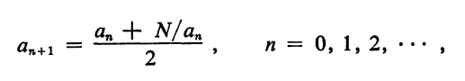
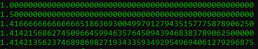
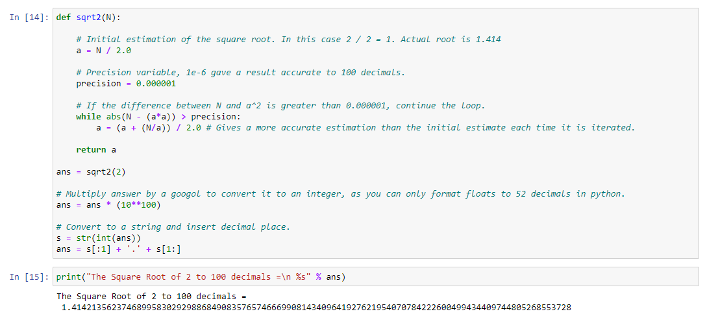
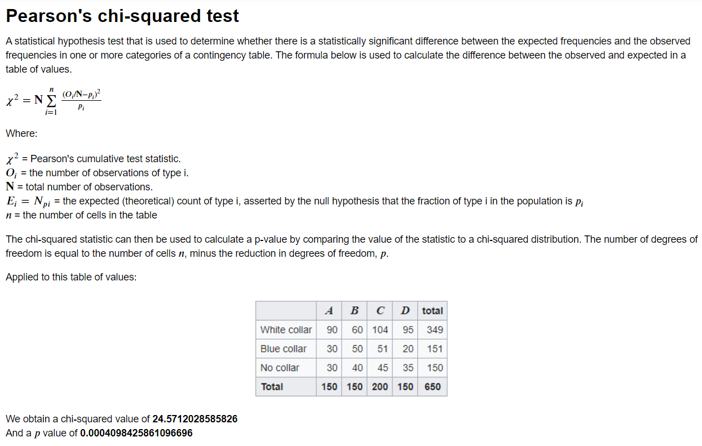
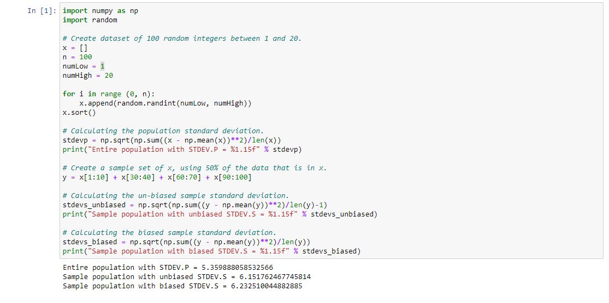
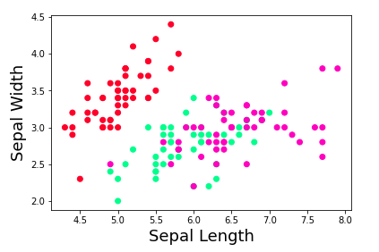
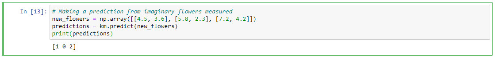
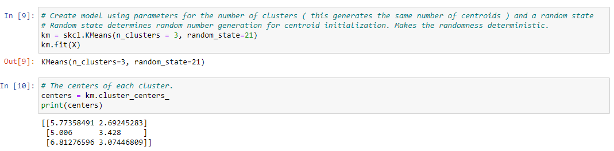
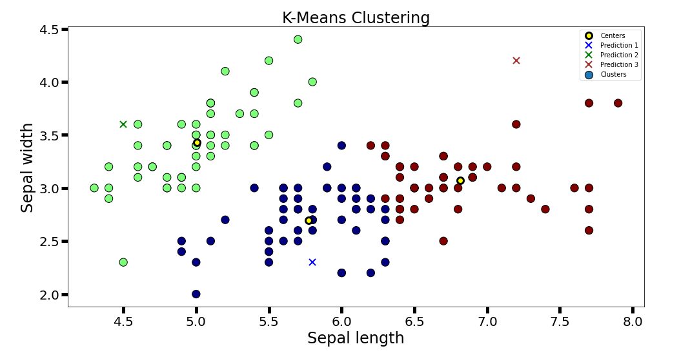

# Emerging-Technologies-Tasks

## Getting Started:
* Download the latest version of Python 3.
* Download Anaconda

## Running the Program
```
Navigate to the project directory in either Anaconda Prompt or CMD
```
```
Run command jupyter notebook in terminal
```
```
Go to > http://localhost:8888/tree
```
***
# TASK 1 - Calculating the square root of 2

*The square root of 2 or root 2 is represented using the square root symbol √ and written as √2 whose value is 1.414. This value is widely used in mathematics. Root 2 is an irrational number as it cannot be expressed as a fraction and has an infinite number of decimals. So, the exact value of the root of 2 cannot be determined.*

## Newton's Method:
[2]


Newton's Method of calculating square roots is an iterative root-finding algorithm, that produces successively better approximations of the root. Where **a0** is an initial approximation of the square root of **N**. If the initial approximation is suitably chosen, the process converges quickly and accurate approximations of root **N** are obtained after only a few iterations. However, if extended multiple-precision approximations to root **N** are sought, the computation time increases rapidly because of the times required for dividing **N** by a many-digit number. Generally, the time required for floating-point division on modern electronic computers compared to floating-point multiplication is at least twice as much for double precision computations.

*This is an example of the algorithm each time it runs. Where **a0 = 1**, **a1 = 1.5**, and so on for 5 iterations until it is accurate to 100 decimal places (python can only display 52).*



## Solution
**Obtain the square root, then multiply it by a googol (a whole number with 100 zeros), this will format the float into an integer, integers can be displayed for many more digits than a float. Then format the integer into a string and manually add in the decimal point to give the appearance of a float with 100 digits of the square root of 2.**


***
# TASK 2 - Calculating Chi-Squared (Pearson's Method)



***
# TASK 3 - Research of Standard Deviation Functions

### Brief:
*The standard deviation of an array of numbers x is
calculated using numpy as **np.sqrt(np.sum((x - np.mean(x))^2)/len(x))** .
However, Microsoft Excel has **two different versions** of the standard deviation
calculation, **STDEV.P and STDEV.S** . The STDEV.P function performs the above
calculation but in the STDEV.S calculation **the division is by len(x)-1** rather
than **len(x)**. Research these Excel functions, writing a note in a Markdown cell
about the difference between them. Then use numpy to perform a simulation
demonstrating that the STDEV.S calculation is a better estimate for the standard
deviation of a population when performed on a sample. Note that part of this task
is to figure out the terminology in the previous sentence.*

## Differences between STDEV.P & STDEV.S

### STDEV.P:
STDEV.P is an excel function used when calculating the standard deviation of an entire population. A population data set contains all members of a specified group, this is the entire list of possible data values. Uses the count of **n** in formulae.

For example, the population may be "ALL people living in the US."

### STDEV.S:
STDEV.S is an excel function used when calculating a sample of a data set. A sample data set contains a part, or a subset, of a population. The size of a sample is always less than the size of the population from which it is taken. This utilizes the count of **n-1** in formulae

Example: The sample may be "SOME people living in the US."

### Differences:
The only difference between the formulae is that for the sample standard deviation you divide by n-1, n is subtracted by 1 to get an unbiased sample deviation. Subtracting by 1 means that the sample standard deviation will be a **larger** number.

See the example below to understand why n-1 is a better estimate for a sample variance.



### Results:

As we can see from the results, the unbiased formula is generally a decimal or two closer to the population standard deviation than the biased formula.

***
# Task 4 - Machine Learning
## K-means clustering on the Iris Data Set

Clustering is an unsupervised learning method that allows us to group set of objects based on similar characteristics. In general, it can help you find meaningful structure among your data, group similar data together and discover underlying patterns.

One of the most common clustering methods is K-means algorithm. The goal of this algorithm is to partition the data into set such that the total sum of squared distances from each point to the mean point of the cluster is minimized.
K means works through the following iterative process:

* Pick a value for k (the number of clusters to create)
* Initialize k ‘centroids’ (starting points) in your data
* Create your clusters. Assign each point to the nearest centroid.
* Make your clusters better. Move each centroid to the center of its cluster.
* Repeat steps 3–4 until your centroids converge.

### Iris data set *before* performing k-means clustering.


### Code Snippets:
**A snippet of the code used to predict the groups for imaginary flowers marked with X's in the k-means clustering graph.**


**Fitting the model with the data set, center of each cluster also printed.**


### Iris data set *after* performing k-means clustering.


### Results

* As we can see from the plot, the data has been seperated into 3 clusters, green, blue and brown.

* The centroids of each cluster have also been included (yellow dots)

* The prediction points are in their respective group colours depending on what group they're in, contained in the predictions array.

* The group is predicted from which centroid the point is nearest to.

### References
[1] The square root of 2; Ian McLoughlin; https://web.microsoftstream.com/video/214c8379-7c67-45b5-910d-39ec5d269223<br/>
[2] The square root of 2 to 1 million decimals; Jacques Dutka; https://www.jstor.org/stable/2004359?seq=1&cid=pdf-reference<br/>
[3] Methods of Computing Square Roots; Wikipedia; https://en.wikipedia.org/wiki/Methods_of_computing_square_roots
[4] Chi-squared test; Wikipedia;
https://en.wikipedia.org/wiki/Chi-squared_test<br>
[5] Pearson's Chi-squared test; Wikipedia;
https://en.wikipedia.org/wiki/Pearson's_chi-squared_test<br>
[6] Chi-Square Procedures for the Analysis of Categorical Frequency Data; Richard Lowry; https://web.archive.org/web/20171022032306/http://vassarstats.net:80/textbook/ch8pt1.html <br>
[7] Population VS Sample Data; MathBitsNotebook.com; http://mathbitsnotebook.com/Algebra1/StatisticsData/STPopSample.html</br>
[8] Measures of Spread; MathBitsNotebook.com; http://mathbitsnotebook.com/Algebra1/StatisticsData/STSpread.html</br>
[9] Why we divide by n-1 for unbiased sample variance; Sal Khan; https://www.khanacademy.org/math/ap-statistics/summarizing-quantitative-data-ap/more-standard-deviation/v/review-and-intuition-why-we-divide-by-n-1-for-the-unbiased-sample-variance</br>
[10] Clustering with Iris data set; Belen Sanches; https://medium.com/@belen.sanchez27/predicting-iris-flower-species-with-k-means-clustering-in-python-f6e46806aaee</br>
[11] Kmeans Clustering; Scikit-learn; https://scikit-learn.org/stable/modules/generated/sklearn.cluster.KMeans.html</br>
